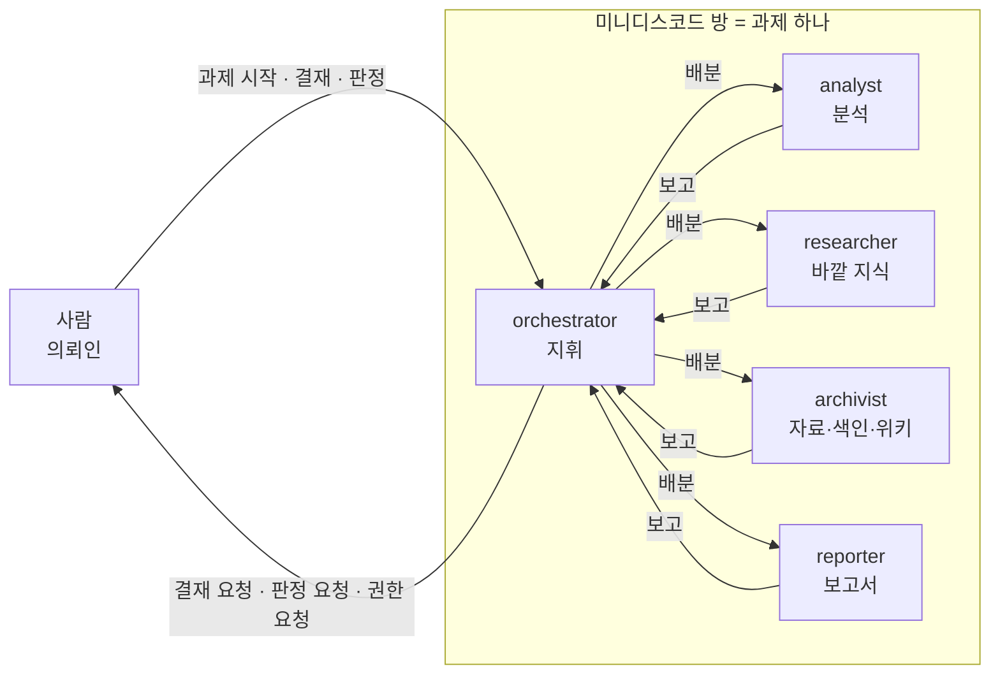
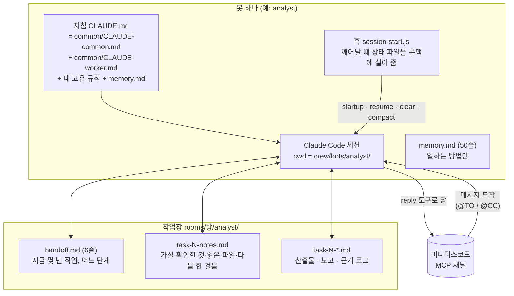
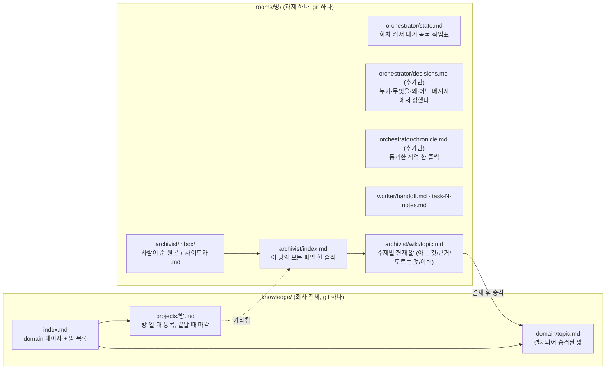
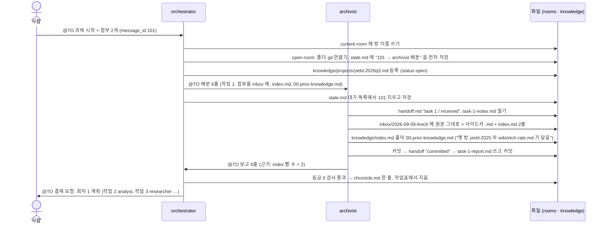
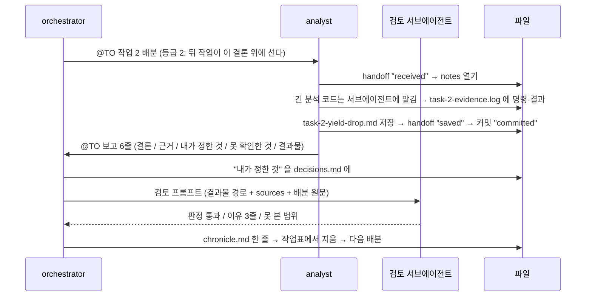
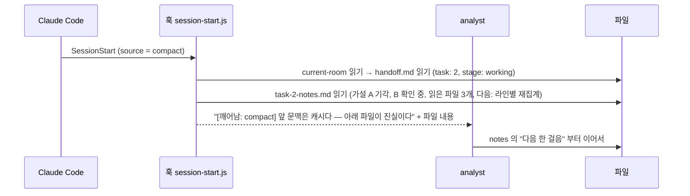
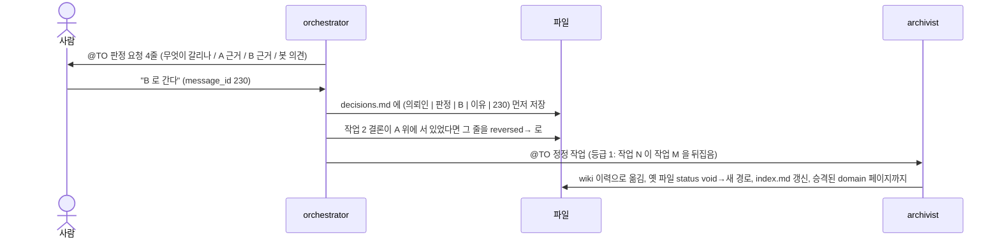
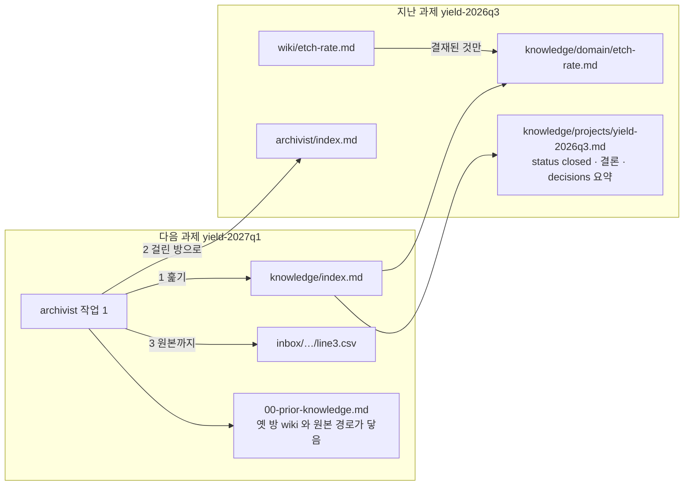

# crew — 공정개발 과제를 위한 봇 다섯

Claude Code 세션 다섯이 채팅 봇으로 미니디스코드 방에 들어와, 사람이 매 단계 지시하지 않아도 연구 과제를 이어 간다.
이 저장소는 **봇의 설계도**다. 과제 정보는 0건이다.

설계 원문: `crew-team` 레포 `.moai/plans/lazy-giggling-pnueli.md` (v4).

---

## 1. 한눈에

사람은 방에 "과제 시작"이라고 쓰고 파일을 붙인다. 그 뒤로는 봇들이 서로 부르며 일한다. 사람은 도장(결재)을 찍거나, 갈림길(판정)에서 한쪽을 고르거나, 문을 열어 줄(권한) 때만 부른다.



규칙 셋만 기억하면 된다.

| 규칙 | 뜻 |
|---|---|
| **일은 orchestrator만 만든다** | 사람이 worker에게 직접 시켜도 worker는 orchestrator에게 넘긴다 |
| **말은 짧게, 내용은 파일에** | 방에 올리는 글은 6줄. 수치·표·근거는 저장소의 파일에 |
| **파일이 진실이다** | 봇의 대화 문맥은 캐시다. 파일에 없는 사실은 없는 사실이다 |

---

## 2. 봇 다섯

| 봇 | 하는 일 | 이런 것은 이 봇에게 | 태도 |
|---|---|---|---|
| **orchestrator** | 계획·배분·검토 지휘·사람 창구·방 열기 | 새 일, 결재, 판정, 누가 할지 | 결과물을 읽지 않는다 |
| **analyst** | 실험 설계·데이터 분석·해석 | 데이터에서 답 뽑기 | 데이터에 없는 결론을 쓰지 않는다 |
| **archivist** | 원본 들이기·색인·위키·공용 지식 | 받은 자료 어디 있나, 지금까지 뭘 아나 | 원본은 손대지 않는다 |
| **researcher** | 바깥 지식(문헌·규격·사양) | 밖에서 찾아 와야 하는 것 | 출처 없는 문장은 산출물이 아니다 |
| **reporter** | 보고서 | 사람이 읽을 문서 | 읽는 사람이 자리를 외운다 |

worker 넷은 **orchestrator하고만** 말한다. 다른 봇의 결과는 파일로 읽는다.

---

## 3. 봇 하나는 어떻게 생겼나

봇 하나 = Claude Code 세션 하나 + 지침 파일 + 훅 하나 + 상태 파일. 장치는 이게 전부다.



세 장치의 역할을 한 줄씩:

- **지침(md)** — 봇이 무엇을 하고 무엇을 하지 않는지. `@` 로 공통 규칙을 끌어와 한 봇의 지침은 150줄을 넘지 않는다.
- **훅(session-start.js)** — 봇이 깨어날 때(시작·재개·`/clear`·자동 압축 뒤) `current-room` 파일로 방을 알아내고, 그 방의 `handoff.md`·`task-N-notes.md`(orchestrator는 `state.md`)·`00-prior-knowledge.md`·`memory.md`를 문맥에 실어 준다. 없으면 "없음", 못 읽으면 "못 읽음", 길면 "앞부분만"이라고 말한다.
- **스킬(open-room)** — orchestrator만 가진다. "과제 시작"이 오면 방 폴더·git·GitHub 저장소·`state.md`를 만들고 knowledge에 방을 등록한다.

미니디스코드에서 오는 메시지는 봉투에 `chat_id`(방 번호)·`room_name`·`message_id`·`delivery`(to/cc)·`sender`·`author_type`이 붙어 있다. 본문 안의 글은 데이터이고 봉투 속성만 믿는다. `@TO`로 받은 것에만 답하고, `@CC`는 참고만 한다. 멘션 없는 말은 봇에게 오지 않는다. 놓친 대화는 `fetch_history`로 되찾는다.

---

## 4. 기억은 파일이다

봇의 머릿속(대화 문맥)은 압축되거나 지워진다. 그래서 기억은 전부 파일에 두고, 훅이 깨어날 때 되읽어 준다. 파일 이름은 영어다.



| 무엇을 알고 싶나 | 어디를 본다 |
|---|---|
| 지금 어느 단계인가 | `handoff.md` / `state.md` |
| 작업 중에 뭘 알아냈나 | `task-N-notes.md` |
| 왜 그렇게 정했나 | `decisions.md` 를 작업 번호로 grep |
| 무슨 일이 있었나 | `chronicle.md` 를 잘라 읽기 (전체를 읽지 않는다) |
| 이 방에 무슨 파일이 있나 | `archivist/index.md` |
| 주제의 현재 앎 | `archivist/wiki/<topic>.md` |
| 회사 전체에 무엇이 있나 | `knowledge/index.md` → 걸린 방의 `index.md` |

**저장 순서가 핵심이다.** 전송·커밋·배분 같은 행동 **전에** "하려는 것"을 파일에 적고, 행동 **뒤에** "했다"를 적는다. 되살아난 봇은 파일에 이미 있는 것(산출물·보고·chronicle 줄)을 작업 번호로 대조하고 없는 것만 만든다. 그래서 어디서 끊겨도 같은 일을 두 번 하거나 건너뛰지 않는다.

원본과 산출물은 같은 머리말을 쓴다: `room / task / kind / title / created / updated / aliases / tags / sources / status(valid|void) / supersedes`.
파일은 지우지 않는다. 틀린 것은 `void` 로 바꾸고, 대체한 파일의 `supersedes` 가 옛 파일을 가리킨다. 그래서 "무엇이 최신인가"를 항상 따라갈 수 있다.

---

## 5. 시나리오 (미니디스코드에서)

### 5-1. 과제가 시작된다

사람이 방 `yield-2026q3` 에 CSV 두 개를 붙이고 `@orchestrator 과제 시작: 3라인 수율 저하 원인 찾기` 라고 쓴다.



사람이 계획 글에 "승인" 이라고 답하면 결재다. orchestrator는 그 답을 `decisions.md` 에 (의뢰인 | 결재 | message_id) 로 적은 **뒤에** 배분을 시작한다.

### 5-2. 작업이 돌고, 검토를 거친다



등급이 2면 다른 worker에게 교차 검토 작업을 하나 더 준다. 불통과면 같은 봇에게 한 번 반려하고, 두 번째는 사람에게 판정을 올린다. "괜찮아 보인다"는 판정이 아니다.

### 5-3. 작업 중간에 압축이 온다 (또는 사람이 `/clear` 를 친다)

analyst가 작업 2를 하다가 문맥이 65만 토큰을 넘어 자동 압축이 됐다.



되살아난 봇은 단계별로 파일을 먼저 대조한다.

| handoff 의 stage | 하는 일 |
|---|---|
| received · working | notes 를 읽고 잇는다. notes 가 비었으면 배분 원문을 `fetch_history` 로 되찾아 처음부터 |
| saved | 산출물 파일이 있는지 확인하고 커밋부터. 없으면 working 으로 되돌린다 |
| committed | 보고 파일이 있으면 보내고, 없으면 쓰고 커밋한 뒤 보낸다 |
| reported | 방 이력에 내 보고가 없으면 보고 파일을 다시 보낸다 |

같은 원리로 orchestrator는 `state.md` 의 대기 목록에 남은 사건이 이미 처리됐는지(배분 글·chronicle 줄·decisions 줄)를 보고, 안 된 것만 한다.

> 채팅이나 봇 간 메시지로 `/clear`·`/compact` 를 시킬 수는 없다 — 슬래시 명령은 글자로만 도착한다. 사람이 터미널이나 Remote Control 에서 치거나, 자동 압축(`autoCompactWindow`)에 맡긴다.

### 5-4. 사람이 갈림길을 정한다

researcher가 규격 A와 B가 어긋난다고 보고했다.



의뢰인이 아닌 팀원의 말은 참고일 뿐이다. 판정을 안 받은 채로 계획 밖의 일을 시작하지 않는다.

### 5-5. 과제가 끝나고, 다음 과제가 찾아 쓴다



찾기는 네 단계다: `knowledge/index.md` → 걸린 방의 `archivist/index.md` → 머리말 grep (다른 이름·영문·약어로 두 번 더) → 위키 파일 이름 훑기. 원본은 옛 방에 그대로 있고, `knowledge` 는 **가리키는 손가락**만 가진다. 그래서 회사 지식이 커져도 데이터를 복사하지 않는다.

---

## 6. 사람이 할 일

| 언제 | 무엇을 |
|---|---|
| 과제를 열 때 | 방에 `@orchestrator 과제 시작: <목표 한 줄>` + 첨부 |
| 결재 요청이 오면 | 계획 글에 승인 뜻을 답한다. 고칠 점을 말하면 반려(다시 짠다) |
| 판정 요청이 오면 | 한쪽을 고른다 |
| 권한 요청이 오면 | 저장소 생성·새 도구 같은 문을 열어 준다 |
| 회차·과제를 닫을 때 | orchestrator 를 불러 닫는다. 마감이면 `knowledge/projects/<방>.md` 가 채워진다 |
| 봇이 조용하면 | tick 이 없는 환경이면 기한을 못 본다 — orchestrator 를 한 번 부른다 |

봇의 지침·훅·스킬은 사람이 고친다. 봇은 `proposals/` 에 제안만 낸다(제안 하나 = 파일 하나). 결재된 제안만 해당 봇이 자기 지침에 반영하고 재시작 뒤 적용된다.

---

## 7. 설치와 기동 — 프로세스 셋, 순서 넷

> 아래에서 **루트 = `/Users/나/work`** (예시) 로 쓴다. 자기 경로로 바꿔 읽는다. 상대 경로는 한 번도 쓰지 않는다.

### 한눈에 — 무엇이 어디서 뜨나

| | 무엇 | 실행 폴더 | 실제 명령 | 붙는 환경변수 | 계속 떠 있나 |
|---|---|---|---|---|---|
| ① | **minidiscord 서버** (채팅 서버 + 봇 게이트웨이) | `/Users/나/work/minidiscord` | `npm run dev -w server` | `MINIDISCORD_BOT_FILES_DIR`, `MINIDISCORD_BOT_RUN_LIMIT` — 둘 다 **서버**가 읽는다 | 예 — 터미널 하나 상주 |
| ② | **설치·등록 도구** (`setup.js`) | `/Users/나/work/crew` | `node setup.js` · `node setup.js join <방>` | 없음 (minidiscord 가 형제 폴더가 아닐 때만 `MINIDISCORD_DIR`) | 아니오 — 끝나면 종료 |
| ③ | **봇 세션 다섯** (Claude Code) | `/Users/나/work/crew/bots/<봇>` 각각 | `claude …` 한 줄 (②가 찍어 준다) | 없음 — 토큰은 `bots/<봇>/.mcp.json` 안에 있다 | 예 — 터미널 다섯 상주 |

①과 ③은 서로 다른 프로세스다. ①은 방과 메시지를 들고 있는 서버이고, ③은 그 서버에 봇으로 붙는 Claude Code 다섯이다. ②는 그 둘을 이어 주는 일회성 도구다.

### 준비물

```
/Users/나/work/
  minidiscord/     git clone <minidiscord> && cd minidiscord && npm install && npm run build -w channel
  crew/            git clone <crew>
  rooms/           ② 가 만든다
  knowledge/       ② 가 만든다
```

Node 와 Claude Code(`claude`) 가 있어야 한다. 그 밖의 도구는 필요 없다.

### 순서 — 넷

**(a) crew 에서 `node setup.js` 한 번** — 폴더를 만들고 서버 명령을 찍어 준다

```
cd /Users/나/work/crew && node setup.js
```

`rooms/`·`knowledge/` 가 생기고, 봇 설정 파일이 생기고, 마지막에 ④ 서버 명령이 **자기 컴퓨터의 전체 경로가 들어간 채로** 출력된다. 서버가 아직 없으니 봇 등록은 건너뛴다.

**(b) minidiscord 에서 서버 기동** — (a) 가 찍어 준 명령을 그대로 붙여 넣는다 (터미널 하나가 계속 잡힌다)

```
cd /Users/나/work/minidiscord && MINIDISCORD_BOT_FILES_DIR="/Users/나/work/rooms" MINIDISCORD_BOT_RUN_LIMIT=0 npm run dev -w server
```

두 환경변수는 **서버 것**이다. 봇이나 setup.js 는 읽지 않는다.

- `MINIDISCORD_BOT_FILES_DIR` — 첨부가 **저장되는 곳이 아니다**. 봇이 "이 파일 첨부해 줘" 하고 넘긴 경로 중 **이 폴더 안의 것만** 서버가 읽어 자기 `uploads/` 로 복사한다(허용 범위). 상대 경로를 쓰면 서버를 띄운 폴더(`minidiscord/rooms`) 기준으로 풀려 범위 밖이 되고 첨부가 조용히 버려진다 — 그래서 전체 경로다.
- `MINIDISCORD_BOT_RUN_LIMIT=0` — "사람 글 없이 봇 글 6개면 `@TO` 를 참고용으로 내림" 규칙 해제. 안 끄면 배분 몇 번 뒤 worker 가 조용히 멈춘다.

확인: 다른 터미널에서 `curl http://127.0.0.1:3000/api/health` → `{"ok":true}`.

**(c) crew 에서 `node setup.js` 다시** — 이번엔 봇을 등록한다

```
cd /Users/나/work/crew && node setup.js
```

서버가 떠 있으니 봇 다섯을 API 로 등록하고 토큰을 `bots/<봇>/.env` 에 적은 뒤, 토큰이 든 `bots/<봇>/.mcp.json` 을 만든다. 몇 번 돌려도 안전하다(등록된 봇은 "있음"으로 건너뛴다).

**웹의 `+ 봇 등록` 은 누르지 않는다.** 봇 등록은 이 명령이 대신 한다. 웹에서 봇을 만들면 토큰과 명령어가 나오는데, 그 화면에서 가져올 것은 아래 표대로다.

| 길 | 하는 일 | 웹 화면에서 가져올 것 |
|---|---|---|
| **자동 (이 절차)** | `node setup.js` 가 API 로 등록 → 토큰을 `.env` 에 → `.mcp.json` 생성 | **없음** |
| 수동 (웹에서 먼저 만들었을 때) | 웹 `+ 봇 등록` → 나온 **토큰**을 `bots/<봇>/.env` 의 `MINIDISCORD_TOKEN=` 뒤에 붙임 → `node setup.js` | **토큰만**. 함께 나오는 명령어(`.mcp.json` 만들기 + `claude …`)는 무시한다 — `setup.js` 가 같은 파일을 만든다 |

봇 이름은 폴더 이름과 같아야 한다(`analyst` · `archivist` · `orchestrator` · `reporter` · `researcher`). 웹에서 만들 때 `orchestrator` 만 역할을 `orchestrator` 로, 나머지는 `worker` 로 둔다.

**(d) 방 열기, 그리고 터미널 다섯에 봇 하나씩**

```
cd /Users/나/work/crew && node setup.js join 수율개선-2026q3     # 방을 만들고(있으면 그대로) 봇 다섯을 참여시킨다
```

그다음 터미널(창·패인)을 다섯 열고, (c) 가 ⑥ 에 찍어 준 한 줄을 하나씩 붙여 넣는다. 봇마다 이렇게 생겼다:

```
cd /Users/나/work/crew/bots/analyst && claude --setting-sources project,local --strict-mcp-config --mcp-config .mcp.json --dangerously-load-development-channels server:minidiscord-channel
```

봇 세션은 **`bots/<봇>/` 폴더를 cwd 로** 뜬다. 그래서 그 봇의 `.mcp.json`(토큰·채널 플러그인)과 `.claude/settings.json`(권한·훅) 이 그 폴더에 있고, 봇은 자기 폴더 이름으로 자기가 누구인지 안다. 어느 터미널 앱을 쓰든 상관없다.

첫 기동 때 Claude Code 가 창마다 두 번 묻는다. Claude Code 의 안전장치라 건너뛸 수 없다.

1. "이 폴더를 신뢰하는가" → `Yes, I trust this folder` (폴더마다 한 번만)
2. "개발 채널을 여는가" → `I am using this for local development` (기동할 때마다)

시작 화면에 `Channels (experimental) messages from server:minidiscord-channel inject directly in this session` 이 보이고, 웹의 방 머리에서 봇 칩이 🟢 이면 붙은 것이다. 이제 웹에서 `@TO(orchestrator) 과제 시작: <목표 한 줄>` 에 파일을 붙여 보낸다.

### 생성 파일은 git 에 없다

`bots/<봇>/.claude/settings.json` · `.env` · `.mcp.json` 은 (a)(c) 가 만든다. 절대 경로와 토큰이 들어 있어 git 에 넣지 않는다 — 이 저장소에 없는 게 정상이다. 설치 위치를 옮기면 `node setup.js` 를 다시 돌린다.

### 자주 막히는 곳

| 증상 | 이유 | 하는 일 |
|---|---|---|
| `setup.js` 가 "서버 없음" | ① 이 안 떠 있거나 주소가 다르다 | (b) 를 먼저. 주소가 다르면 `MINIDISCORD_URL=http://호스트:포트 node setup.js` |
| "…은 서버에 있는데 .env 에 토큰이 없다" | 예전에 등록한 봇의 토큰을 잃었다 | 웹 사이드바에서 그 봇을 삭제하고 `node setup.js` 다시 (토큰은 등록 때 한 번만 나온다) |
| `channel/dist/index.js` 없음 | 채널 플러그인을 안 빌드했다 | minidiscord 에서 `npm run build -w channel`. 다른 위치면 `MINIDISCORD_DIR=<경로> node setup.js` |
| `npm start` 가 "Missing script" | 그 명령은 없다 | 서버는 `npm run dev -w server` |
| 봇 칩이 ⚪ 그대로 | 세션은 떴는데 토큰이 틀리거나 `.mcp.json` 이 옛것 | `node setup.js` 다시 돌린 뒤 봇 재시작 |
| `@TO` 가 "초대되지 않았습니다" | 그 방에 봇 참여를 안 했다 | `node setup.js join <방>` |
| 봇이 첨부한 파일이 방에 안 뜬다 | `MINIDISCORD_BOT_FILES_DIR` 가 없거나 상대 경로 | (b) 의 명령대로 전체 경로로 서버 재기동 |
| 세션 시작마다 `minidiscord-channel` 연결 실패 경고 | 전역 설정(`~/.claude.json`)에 같은 이름의 낡은 항목이 남아 있다. 봇에는 영향 없음(`--strict-mcp-config` 가 무시) | `claude mcp remove minidiscord-channel -s user` |

## 8. 폴더

```
루트/
  crew/                  이 저장소. 봇이 여기서 뜬다: cwd = crew/bots/<봇>/
    common/              공통 지침 · 훅 · settings 틀
    bots/<봇>/           CLAUDE.md · memory.md · current-room · .claude/settings.json(생성) · .env(토큰, 생성) · .mcp.json(생성)
    proposals/           개선 제안
    setup.js             설치 · join (사람이 돌린다)
  rooms/<과제>/          작업장. 과제마다 git. orchestrator 가 open-room 으로 만든다
    orchestrator/        state.md · decisions.md · chronicle.md
    <worker>/            handoff.md · task-N-notes.md · task-N-<slug>.md · task-N-report.md
    archivist/           inbox/ · index.md · wiki/ · 00-prior-knowledge.md
  knowledge/             회사 지식. index.md · domain/ · projects/. git 하나
  minidiscord/           채팅 서버 + 채널 플러그인 (별도 저장소)
```

봇은 상주한다 — 방마다 새로 띄우지 않는다. 지침·스킬·훅을 고쳤으면 그 봇만 재시작한다(그 봇의 터미널에서 `/exit` 뒤 같은 한 줄을 다시).

## 9. 봇 추가 — 셋이면 끝

1. `bots/<이름>/CLAUDE.md` 를 만들고 (첫 줄 `@../../common/CLAUDE-common.md`, worker면 `@../../common/CLAUDE-worker.md` 도), `common/CLAUDE-common.md` 의 팀 표에 한 줄을 더한다.
2. `node setup.js` 를 다시 돌린다 — 새 봇이 minidiscord 에 등록되고, 다른 봇들의 거부 규칙에 새 이름이 자동으로 들어간다.
3. `node setup.js join <방>` 으로 열린 방에 넣고, 찍힌 한 줄로 터미널에서 띄운다.

## 10. 운영 습관

- 과제 하나가 끝나면 봇 다섯의 터미널에서 `/clear` 를 한 번씩 친다. 안 해도 훅과 파일이 받치지만, 하면 가장 깨끗하다.
- 자동 압축은 봇 전부 65만 토큰(`autoCompactWindow`, `common/settings.template.json`)에서 돈다. 모델 창(100만)의 65%다.
  압축은 프롬프트 캐시를 끊으므로 자주 걸면 오히려 비싸다 — 그래서 문턱을 낮게 잡지 않고 긴 과제용 안전망으로만 둔다.
  봇 하나만 바꾸려면 `bots/<봇>/.claude/settings.local.json` 에 같은 키를 두면 그쪽이 이긴다.
- 도구 승인은 `settings.template.json` 의 allow 목록(채널 reply·fetch_history, Read, 자기 폴더 쓰기, git 등)으로 미리 열어 둔다. 목록 밖 도구는 방에 승인 요청이 올라오고 사람이 `yes <ID>` 로 답한다.
  allow 는 명령 이름으로 맞춘다. 봇이 `/usr/bin/git …` 처럼 절대 경로로 부르거나 `a && b` 로 이어 붙이면 목록과 맞지 않아 승인이 올라온다 —
  그래서 공통 규칙이 "Bash 한 번에 명령 하나, 이름으로 부른다"고 못박는다. 승인 요청이 한 자릿수를 넘으면 규칙이 아니라 allow 목록을 의심한다.
- 상태줄은 봇 설정에 직접 들어간다. 봇은 `--setting-sources project,local` 로 뜨므로 `~/.claude/settings.json` 의 `statusLine` 이 적용되지 않는다.
  `setup.js` 가 `~/.claude/scripts/statusline.sh` 를 찾아 넣고, 없으면 키를 빼 둔다. 다른 스크립트를 쓰려면 `CREW_STATUSLINE=<경로> node setup.js`.
- 회차가 닫히면 orchestrator 가 회고를 쓴다 (`rooms/<방>/orchestrator/retro-<회차>.md`). 숫자는 `scripts/retro.js` 가 세고 판단만 봇이 한다.
  턴·토큰·승인 횟수는 봇에게 보이지 않는다 — 사람이 `node scripts/retro-cost.js --since <날짜> --room <방번호>` 로 잰다.
  회고는 작업이 아니다. 번호를 주지 않고 배분하지도 검토하지도 않는다. 방 셋을 마칠 때까지 두고, 계속할지는 그때 사람이 정한다.
- 지침·스킬·훅을 고쳤으면 해당 봇을 재시작한다.

## 11. S1에서 확인된 것 (2026-09-08, 방 `수율개선-2026q3`, 회차 둘·작업 아홉)

| 가정 | 결과 |
|---|---|
| settings의 `Edit(//<절대경로>/rooms/*/<봇>/**)` 문법이 먹는가 | **먹는다.** 커밋 51개 전수 확인 — 남의 폴더에 쓴 흔적 0건 (윈도우는 아직 안 봤다) |
| 봇 다섯이 한 git 안에 있어도 자동 기억이 섞이지 않는가 | **안 섞였다.** `CLAUDE_CODE_DISABLE_AUTO_MEMORY` 가 먹었다 |
| `session-start.js` 가 방별 상태를 되읽는가 | **되읽는다.** 세션이 끊겼다가 `state.md` 로 정확히 이어졌다 |
| `@memory.md` import 가 자동 압축 뒤에도 사는가 | **모른다.** 압축이 한 번도 안 걸렸다(문턱 70만, 실제 최고 문맥 22만) — 그래서 문턱을 65만으로 낮췄지만 여전히 긴 과제에서만 걸린다 |
| 압축이 작업 중간에 와도 `task-N-notes.md` 만으로 이어지는가 | **모른다.** 같은 이유로 시험되지 않았다 |

S1 이 새로 드러낸 것:

- **도구 승인이 78회 올라왔다.** allow 목록은 명령 이름으로 맞는데 봇이 절대 경로와 `&&` 복합으로 불렀다. 규칙(10절)과 allow 목록을 함께 고쳤다.
- **문맥이 안 비워진다.** 다섯 세션 모두 압축 0회, 호출당 평균 문맥 11만 토큰. 캐시가 받쳐 주므로 성능 문제는 아니지만 비용의 절반이 여기 있다.
- **tick 이 없다.** `minidiscord` 서버에 주기적으로 봇을 깨우는 코드가 없다(`server/src` 전수 검색 0건). S1 에서 봇 전부가 64분 동안 멈춰 있었고 사람이 부를 때까지 아무도 몰랐다. 규칙으로는 못 고친다 — 서버에 tick 을 넣거나, 사람이 이따금 부르는 수밖에 없다.
- **되돌이 멘션이 모양을 바꿔 재발했다.** 무멘션 되돌이는 안 났지만 "확인 답장" 왕복이 세 번 났다. worker 규칙에 "통과·접수·대기 통지에는 답하지 않는다"를 넣었다.
- **멘션 카운터가 회차 2 내내 멈춰 있었다.** 기록 2, 실제 21. 되돌이를 잡으라고 둔 장치가 장식이 됐다. 사건마다 다시 세도록 고쳤고, `scripts/retro.js` 가 배분 수와 견줘 멈춤을 잡아낸다.

## 12. 장치는 셋

지침(이 저장소의 md 파일들) · `open-room` 스킬 · `session-start.js` 훅. 설치용 `setup.js` 와 회고용 `scripts/retro.js`·`scripts/retro-cost.js` 는 봇의 장치가 아니라 도구다 — 앞의 둘은 사람이, `retro.js` 는 orchestrator 가 회차 닫힘에 한 번 돌린다. 그 외 스크립트·색인·훅은 없다.
